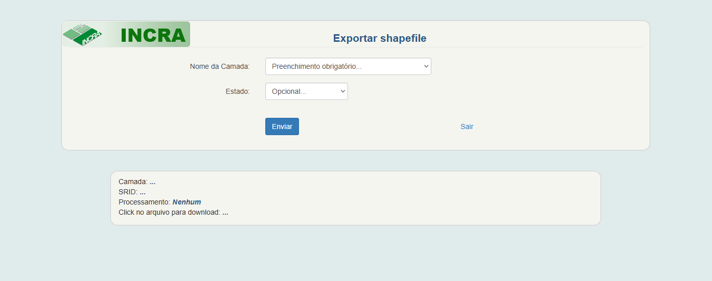
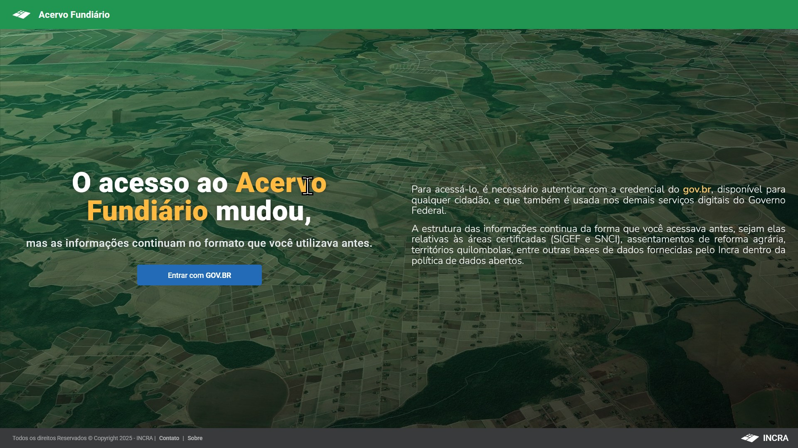

# INCRA

 

O [INCRA](https://www.gov.br/incra/pt-br) é o _Instituto Nacional de Colonização e Reforma Agrária_, uma autarquia federal brasileira vinculada ao [Ministério do Desenvolvimento Agrário e Agricultura Familiar](https://www.gov.br/mda/pt-br).

Sua missão prioritária é:

- Realizar a reforma agrária: Isso envolve a obtenção de terras (por desapropriação, compra ou destinação de terras públicas) e a criação e consolidação de projetos de assentamento para famílias rurais sem terra ou com pouca terra.
- Manter o cadastro nacional de imóveis rurais: O INCRA administra o Cadastro Nacional de Imóveis Rurais (CNIR) e emite o Certificado de Cadastro de Imóvel Rural (CCIR), que é essencial para o proprietário rural.
- Administrar as terras públicas da União: É responsável pela gestão e regularização fundiária das terras públicas federais.
- Realizar o ordenamento fundiário nacional: Trata de questões como o georreferenciamento de imóveis rurais, a limitação de aquisição de terras por estrangeiros, e a titulação de assentamentos e ocupações tradicionais (como quilombolas).

 

O **INCRA** mantem serviço para obtenção de dados espaciais no _site_ [https://certificacao.incra.gov.br/csv_shp/export_shp.py](https://certificacao.incra.gov.br/csv_shp/export_shp.py). Interessante observar que eles usarm um _script_ `export_shp.py` na _url_. Foi estudando como ele funciona que foi possível desenvolver o pacote `incra`.

 

No passado o serviço era "aberto", ou seja, não precisava de área logada para obter os dados. Em um anúncio entusiasmado, informado que o _"acesso ao Acervo Fundiário mudou"_ (para pior), passou a ser solicitado o acesso usando a conta **gov.br** para determinados serviços.

 

O INCRA até mantem página no [Portal de Dados Abertos](https://dados.gov.br/dados/organizacoes/visualizar/instituto-nacional-de-colonizacao-e-reforma-agraria), contudo já foi possível observar que os dados são bastante defasados (em 14.10.2025 os dados disponibilizados eram de 01.08.2023).

A alternativa que resta é estudar e desenvolver uma forma de obter os dados atualizados. Esse estudo está em constante evolução. Iniciei os estudos para obter dados do INCRA desde em 2021.

 

---

## Pacote

- Para gerenciamento do projeto e dependências, utilizou-se o [uv](https://docs.astral.sh/uv/).
- Para documentação foi usado o [MkDocs](https://www.mkdocs.org/)
- Foi usado o [requests](https://pypi.org/project/requests/) para as requisições.
